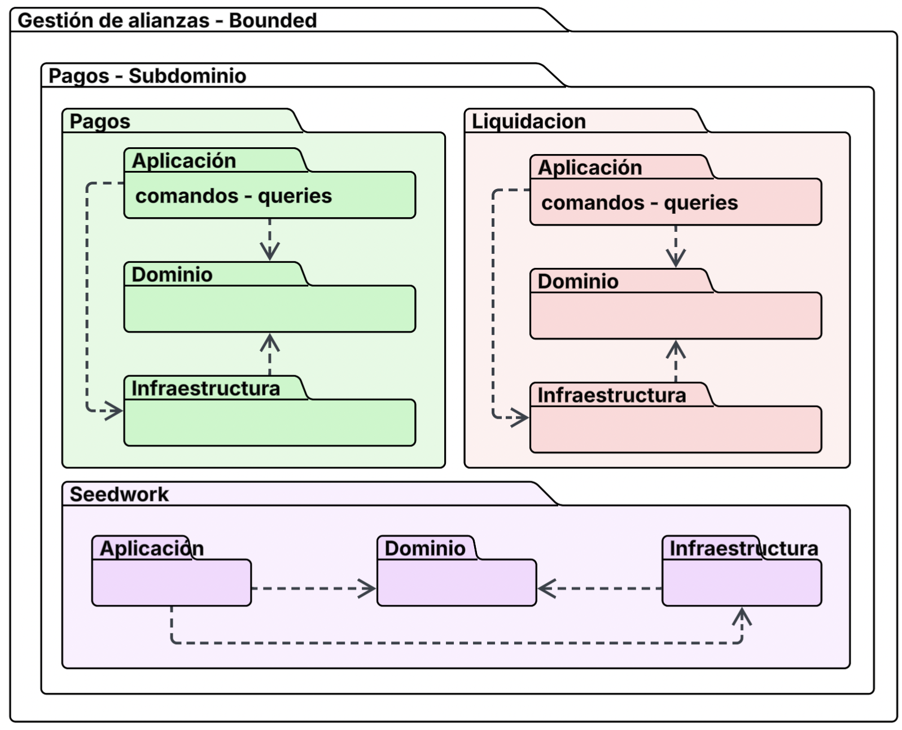
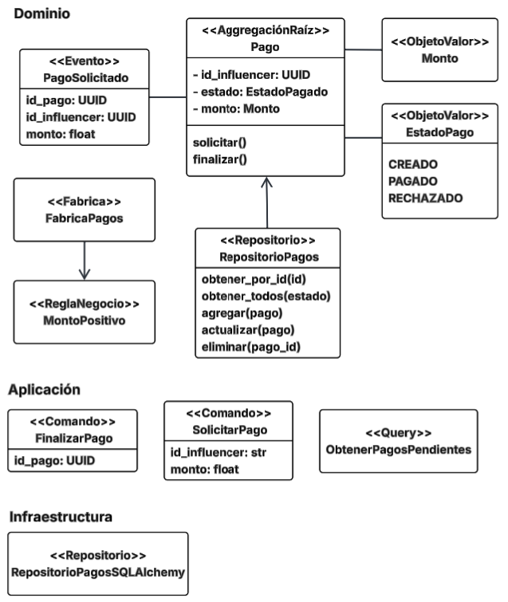
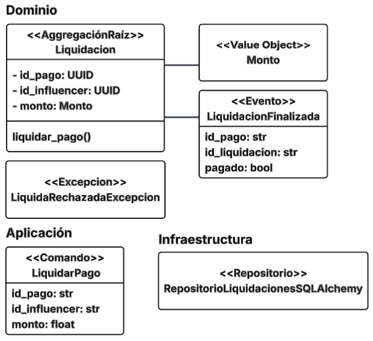

# app_no_monoliticas_sancochoft

Repositorio con código base del servicio de pagos. Prueba de concepto.

## Arquitectura

### Visión general

Los siguientes diagramas son una vista general. Pretender dar una noción de lo que encontrá en el repositorio. Consulte el código fuente para ver más detalles.



### Módulo de pagos



### Módulo de liquidación



Este proyecto implementa un servicio bajo una arquitectura de microservicios basada en eventos, siguiendo los principios de Domain-Driven Design (DDD). El objetivo principal es experimentar y validar atributos de calidad relevantes (escalabilidad, disponibilidad y mantenibilidad) mediante escenarios diseñados específicamente para poner a prueba la solución.

La comunicación entre los módulos se realiza exclusivamente a través de eventos de dominio, apoyados en un broker de mensajería para garantizar el desacoplamiento, la asincronía y la tolerancia a fallos. Asimismo, se aplican patrones como CQS e inyección de dependencias.

A continuación, se describen los escenarios de calidad seleccionados, junto con las decisiones arquitectónicas, sensibilidades, tradeoffs y riesgos asociados.

1. Procesamiento de pagos (Escalabilidad)

   Descripción: El sistema debe ser capaz de recibir y procesar un alto volumen de solicitudes de pago de forma asíncrona. Las transacciones se encolan en el broker de mensajes, evitando pérdidas y garantizando su eventual procesamiento.

   Decisiones arquitecturales: Uso de eventos de dominio para comunicar los módulos y broker de mensajería para encolar transacciones.

   Sensibilidad: La capacidad del broker de manejar el volumen de transacciones concurrentes.

   Tradeoffs: Mayor complejidad en la infraestructura (broker + múltiples consumidores) a cambio de escalabilidad y tolerancia a fallos.

   Riesgo: Saturación del broker si el escalamiento automático no se configura adecuadamente.

2. Reintento de pagos fallidos (Disponibilidad / Confiabilidad)

   Descripción: Ante un error en la transacción, el evento de pago fallido debe reenviarse al broker para ser reintentado hasta completar el ciclo de forma exitosa.

   Decisiones arquitecturales: Implementación de retry policies y Dead Letter Queues (DLQ) en el broker. Uso de event-driven retry como táctica de recuperación.

   Sensibilidad: Tiempo máximo de reintento y políticas de backoff configuradas.

   Tradeoffs: Más intentos de reenvío generan mayor consumo de recursos y posibles duplicidades, aunque mejoran la confiabilidad.

   Riesgo: Un error permanente (ej. datos inválidos) podría generar ciclos infinitos si no se gestionan adecuadamente las DLQ.

3. Evolución del código y mantenibilidad (Mantenibilidad / Evolutividad)

   Descripción: La arquitectura implementada en el repositorio está diseñada para facilitar la evolución del código y su mantenibilidad. Esto permite incorporar nuevas funcionalidades, realizar cambios en la lógica de negocio o sustituir módulos sin afectar el resto del sistema.

   Decisiones arquitecturales: Uso de arquitectura en capas y principio de inversión de dependencias para desacoplar la lógica de negocio de la infraestructura. Aplicación de contextos acotados de DDD para aislar dominios y reducir el impacto de cambios.

   Sensibilidad: La correcta definición de límites entre módulos y el cumplimiento de los principios de diseño limpio (separación de responsabilidades).

   Tradeoffs: Mayor esfuerzo inicial en el diseño y estructuración del código, pero con beneficios a largo plazo en mantenibilidad y adaptabilidad.

   Riesgo: Si no se documentan ni gestionan adecuadamente los cambios, la arquitectura podría perder coherencia y generar acoplamientos innecesarios.

## Estructura del proyecto

```sh
src
└── alpespartners
    ├── api
    │   └── pagos.py
    ├── config
    ├── modulos
    │   ├── liquidacion
    │   │   ├── aplicacion
    │   │   ├── dominio
    │   │   └── infraestructura
    │   └── pagos
    │       ├── aplicacion
    │       ├── dominio
    │       └── infraestructura
    └── seedwork
        ├── aplicacion
        ├── dominio
        ├── infraestructura
        └── presentacion
```

- `src/alpespartners/api`: En este módulo está la API en Flask. Es el punto de entrada a todo el servicio.
- `src/alpespartners/modulos/liquidacion`: Módulo de liquidación. Encargado de comunicarse con sistemas externos que gestionan el pago de los clientes.
- `src/alpespartners/modulos/pagos`: Módulo de pagos. Encargando de gestionar los pagos a los clientes.
- `src/alpespartners/seedwork`: Definiciones generales usados por los módulos del servicio.

## AlpesPartners

### Ejecutar Aplicación

### Iniciar servicios

Los servicios son ejecutados a través de docker-compose, y la API desde local.

En una terminal, ejecute:

```bash
docker compose --profile pulsar up
```

En otra terminal levante la base de datos:

```bash
docker compose --profile alpespartners up
```

### Iniciar API

1. Cree un entorno virtual de Python

```bash
python3 -m venv env
```

2. Active el entorno virtual

```bash
source env/bin/activate
```

3. Instale dependencias

```bash
pip install -r requirements.txt
```

4. Inicie la API

```bash
flask --app src/alpespartners/api run
```

### Colección de Postman

Puede usar la [colección de Postman Alpes Partners](./docs/Alpes%20Partners.postman_collection.json) de ejemplo. Descargue este archivo e impórtelo desde Postman.
