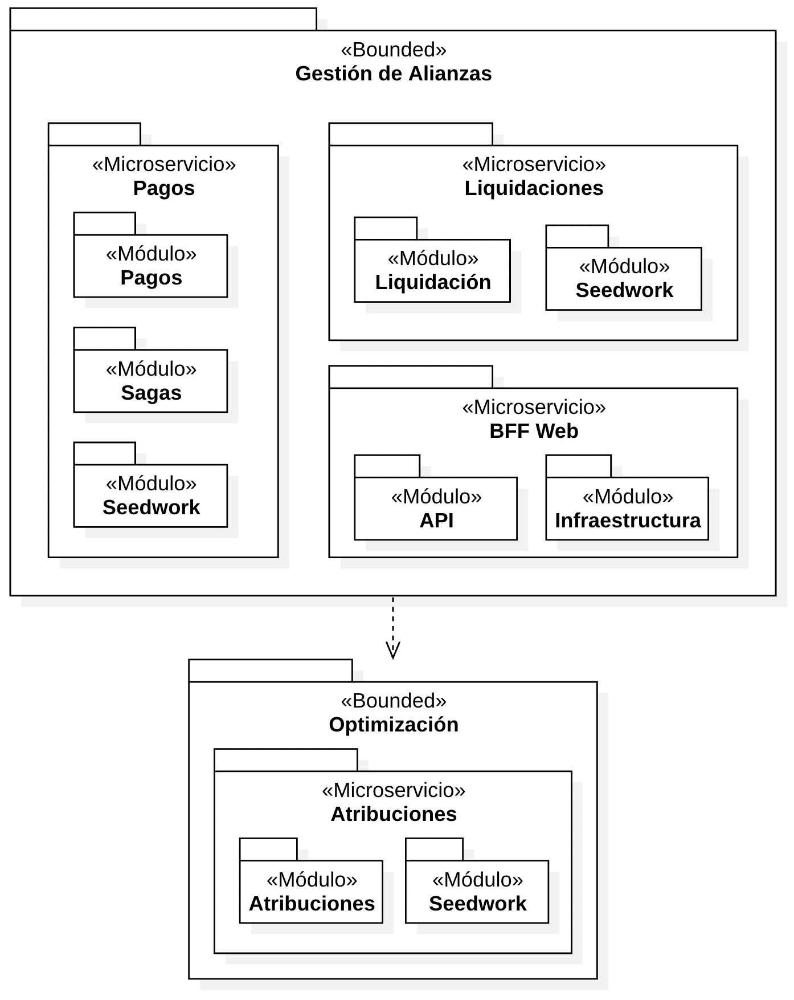

# app_no_monoliticas_sancochoft

Repositorio con código base del servicio de pagos. Prueba de concepto.

## Arquitectura

### Visión general

Los siguientes diagramas son una vista general. Pretender dar una noción de lo que encontrá en el repositorio. Consulte el código fuente para ver más detalles.


| Comandos y eventos por microservicios |
|-----------------------|
|   |


| Saga Log - Exitoso       | Saga Log - Fallido    |
|--------------------------|-----------------------|
| 1. SolicitarPago         | 1. SolicitarPago      |
| 2. PagoSolicitado        | 2. PagoSolicitado     |
| 3. ProgramaCompletado    | 3. ProgramaCompletado |
| 4. LiquidacionFinalizada | 4. LiquidacionFallida |
| 5. PagoPagado            | 5. PagoRechazado      |
|                          | 6. ProgramaReabierto  |


| Módulos |
|-----------------------|
|   |

Este proyecto implementa un 4 servicios bajo una arquitectura de microservicios basada en eventos, siguiendo los principios de Domain-Driven Design (DDD). El objetivo principal es experimentar y validar atributos de calidad relevantes (escalabilidad, disponibilidad y mantenibilidad) mediante escenarios diseñados específicamente para poner a prueba la solución.

La comunicación entre los módulos se realiza exclusivamente a través de eventos de dominio, apoyados en un broker de mensajería para garantizar el desacoplamiento, la asincronía y la tolerancia a fallos. Asimismo, se aplican patrones como CQS e inyección de dependencias.

A continuación, se describen los escenarios de calidad seleccionados, junto con las decisiones arquitectónicas, sensibilidades, tradeoffs y riesgos asociados.

1. Procesamiento de pagos (Escalabilidad)

   Descripción: El sistema debe ser capaz de recibir y procesar un alto volumen de solicitudes de pago de forma asíncrona. Las transacciones se encolan en el broker de mensajes, evitando pérdidas y garantizando su eventual procesamiento.

   Decisiones arquitecturales: Uso de eventos de dominio para comunicar los módulos y broker de mensajería para encolar transacciones.

   Sensibilidad: La capacidad del broker de manejar el volumen de transacciones concurrentes.

   Tradeoffs: Mayor complejidad en la infraestructura (broker + múltiples consumidores) a cambio de escalabilidad y tolerancia a fallos.

   Riesgo: Saturación del broker si el escalamiento automático no se configura adecuadamente.

2. Reintento de pagos fallidos (Disponibilidad / Confiabilidad)

   Descripción: Ante un error en la transacción, el evento de pago fallido debe reenviarse al broker para ser reintentado hasta completar el ciclo de forma exitosa.

   Decisiones arquitecturales: Implementación de retry policies y Dead Letter Queues (DLQ) en el broker. Uso de event-driven retry como táctica de recuperación.

   Sensibilidad: Tiempo máximo de reintento y políticas de backoff configuradas.

   Tradeoffs: Más intentos de reenvío generan mayor consumo de recursos y posibles duplicidades, aunque mejoran la confiabilidad.

   Riesgo: Un error permanente (ej. datos inválidos) podría generar ciclos infinitos si no se gestionan adecuadamente las DLQ.

3. Evolución del código y mantenibilidad (Mantenibilidad / Evolutividad)

   Descripción: La arquitectura implementada en el repositorio está diseñada para facilitar la evolución del código y su mantenibilidad. Esto permite incorporar nuevas funcionalidades, realizar cambios en la lógica de negocio o sustituir módulos sin afectar el resto del sistema.

   Decisiones arquitecturales: Uso de arquitectura en capas y principio de inversión de dependencias para desacoplar la lógica de negocio de la infraestructura. Aplicación de contextos acotados de DDD para aislar dominios y reducir el impacto de cambios.

   Sensibilidad: La correcta definición de límites entre módulos y el cumplimiento de los principios de diseño limpio (separación de responsabilidades).

   Tradeoffs: Mayor esfuerzo inicial en el diseño y estructuración del código, pero con beneficios a largo plazo en mantenibilidad y adaptabilidad.

   Riesgo: Si no se documentan ni gestionan adecuadamente los cambios, la arquitectura podría perder coherencia y generar acoplamientos innecesarios.

## Estructura del proyecto

```sh
├── .github/workflows # Workflows de GitHub para CI/CD
├── alianzas_bff      # Backend for Frontend de Alianzas. Es el punto de entrada de la aplicación.
├── atribuciones      # Microservicio de atribuciones. Encargado de administrar las atribuciones de influencers.
├── aws               # Task defintions de AWS Fargate
├── liquidaciones     # Microservicio de liquidaciones. Simula la comunicación con servicios externos para pagos.
└── pagos             # Microservicio de pagos. Encargada de gestionar los pagos de las atribuciones.
```

## AlpesPartners

### Ejecutar Aplicación

### Iniciar servicios

Los servicios son ejecutados a través de docker-compose, y la API desde local.

En una terminal, ejecute:

```bash
docker compose --profile pulsar up
```

### Iniciar servicios

1. Levante el servicio de pagos

```bash
docker compose --profile pagos up
```

2. Levante el servicio de liquidaciones

```bash
docker compose --profile liquidaciones up
```

3. Levante el servicio de atribuciones

```bash
docker compose --profile atribuciones up
```

4. Inicie el BFF

```bash
docker compose --profile alianzas_bff up
```

### Colección de Postman

Puede usar la [colección de Postman Alpes Partners](./docs/Alpes%20Partners.postman_collection.json) de ejemplo. Descargue este archivo e impórtelo desde Postman.

### Participacion de los integrantes

- Jhorman Galindo: Participó en la documentación general y en reuniones de coordinación. Desarrolló un microservicio BFF con comunicación basada en comandos. Se encargó de justificar los tipos de eventos y definir esquemas.

- Leiner Barrios: Contribuyó en la documentación y en la construcción colaborativa de los diagramas. Desarrolló un microservicio ATRIBUCIONES implementando CRUD en la capa de datos. Ayudó a configurar la topología de datos.

- Jaime Gallo: Apoyó en la documentación y reuniones de coordinación. Desarrolló un microservicio PAGOS y lo integró al repositorio común. Se enfocó en la propagación de comandos y eventos mediante Apache Pulsar y en el despliegue de los servicios en la plataforma elegida en los demás micros.

- Alejandro Bogotá: Colaboró en la documentación grupal y en la construcción de diagramas. Desarrolló un microservicio LIQUIDACIONES. Participó en la validación de los escenarios de calidad definidos en la entrega pasada. Tiene ya casi listo la configuración de código en la parte CLOUD.
NOTA: Todos trabajaron en 1 solo repositorio online de forma síncrona, documentando y construyendo los diagramas de los 4 microservicios.
